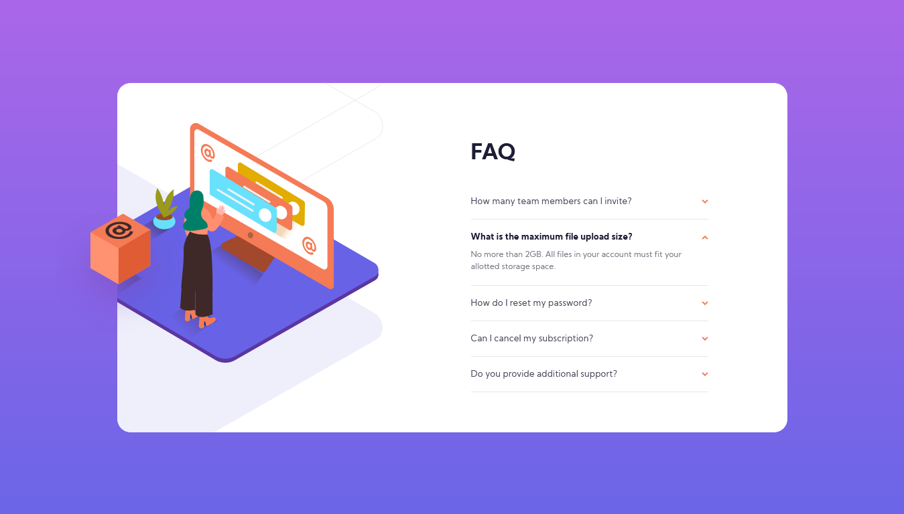

# Frontend Mentor - FAQ accordion card solution

This is a solution to the [FAQ accordion card challenge on Frontend Mentor](https://www.frontendmentor.io/challenges/faq-accordion-card-XlyjD0Oam). Frontend Mentor challenges help you improve your coding skills by building realistic projects!

## Table of contents

- [Overview](#overview)
  - [The challenge](#the-challenge)
  - [Screenshot](#screenshot)
  - [Links](#links)
- [My process](#my-process)
  - [Built with](#built-with)
  - [What I learned](#what-i-learned)
  - [Continued development](#continued-development)
  - [Useful resources](#useful-resources)
- [Author](#author)

## Overview

### The challenge

Users should be able to:

- View the optimal layout for the component depending on their device's screen size
- See hover states for all interactive elements on the page
- Hide/Show the answer to a question when the question is clicked

### Screenshot

Desktop view:



### Links

- Solution URL: [Click here](https://www.frontendmentor.io/solutions/html-5-scss-bem-and-flexbox-4yrA_iFW0)
- Live Site URL: [See live site here](https://juanbonilla.me/FEM_faq-accordion-card/)

## My process

### Built with

- Semantic HTML5 markup
- CSS / SCSS custom properties
- Flexbox
- JavaScript
- Mobile-first workflow
- BEM Methodology

### What I learned

This is my first Frontend mentor challenge using JavaScript, in this case I chose to get every button in the document usign ```getElementsByTagName('button')```. I did this because I didn't want to put an id attribute to every button in my card and assign a click event one by one. So, I thought in a way to add a click event to each button obtaining a buttons array an iterating it with a forEach function.

```js
let buttons = [...document.getElementsByTagName('button')];

buttons.forEach(button => {
    button.addEventListener('click', toggle);
});
```

### Continued development

I want to continue improving my design skills focusing on the details. Also, it is important for me to keep learning JavaScript to make websites truly interactive.

### Useful resources

- [How can I transition height: 0; to heigth: auto; in CSS](https://stackoverflow.com/questions/3508605/how-can-i-transition-height-0-to-height-auto-using-css) - This helped me understanding how to give an slide effect when clicking a question using the css *transition* property. 

## Author

- Website - [juanbonilla.me](https://juanbonilla.me)
- Frontend Mentor - [@juanpb96](https://www.frontendmentor.io/profile/juanpb96)
- Twitter - [Juan Bonilla](https://www.linkedin.com/in/juan-pablo-bonilla-6b8730115/)
